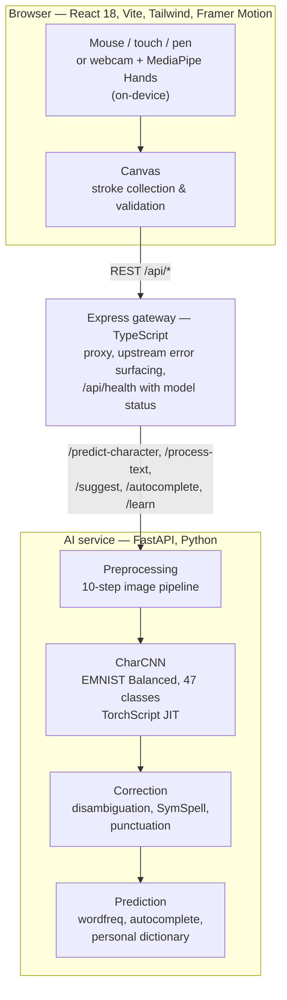

# AirScript — touchless air writing and drawing

Write or draw in the air with your hand, or with a mouse or finger, and watch a
CNN plus an NLP pipeline turn the strokes into corrected text. Hand tracking
(MediaPipe) runs entirely in the browser; only stroke images ever leave the page.

**Try it:** [https://airscript-frontend.vercel.app](https://airscript-frontend.vercel.app)
— no webcam needed. Draw with the mouse, or press *Replay a sample* and the app
demonstrates itself. Hand tracking is an opt-in upgrade ("Use your hand instead").

## Architecture



Strokes are captured entirely in the browser; the Express layer never does inference itself,
it only routes to the Python service. The personal dictionary is the one piece of state that
persists between sessions — it learns from corrections the user makes.

The client talks to whatever `VITE_API_BASE_URL` points at. Locally that is
`/api` (the gateway, proxied by Vite). The public frontend points straight at
the Hugging Face Space because the free tiers in use do not host the gateway;
the gateway is still the path exercised by the local setup and its tests.

## Live deployment

| Tier | URL | Notes |
|------|-----|-------|
| Frontend | https://airscript-frontend.vercel.app | Vercel |
| AI service | https://saminul-amin-airscript-backend.hf.space | Hugging Face Space, free CPU tier. **Sleeps when idle**: the first request after a quiet period takes up to a minute. The app shows a "waking the service" state while that happens. `GET /health` reports whether trained weights are loaded. |

## The model and its weights

`ai-service/model.py` defines `CharCNN`, trained on EMNIST Balanced with
`train.py`. The trained checkpoint is committed at
`ai-service/saved_model/emnist_cnn.pth` (6.8 MB) next to its SHA-256 in
`emnist_cnn.sha256`.

The service **refuses to start** if the file is missing, cannot be loaded into
`CharCNN`, or does not match the pinned checksum. It never serves predictions
from an untrained network. To supply weights another way:

- set `AIRSCRIPT_MODEL_PATH` to a different `.pth`, or
- set `AIRSCRIPT_MODEL_URL` to a downloadable file (for example a Hugging Face
  model file or a GitHub Release asset); it is fetched once at startup, or
- retrain: `pip install -r requirements-train.txt && python train.py`
  (downloads EMNIST, ~2 GB, and writes a new `.pth` — update the `.sha256`
  file with the new checksum).

`AIRSCRIPT_ALLOW_MISSING_MODEL=1` starts the text endpoints without a model for
development; `/predict` then answers `503` and `/health` reports `degraded`.
Do not set it in production.

Do not change the layer shapes in `model.py` or the 10-step pipeline in
`preprocessing.py` without retraining; the checkpoint and the tests pin them.

## Project structure

```
air-script/
├── ai-service/            # Python FastAPI — CNN, correction pipeline, NLP
│   ├── correction/        # Spell correction, disambiguation, punctuation
│   ├── nlp/               # Word prediction, autocomplete, personal dictionary
│   ├── saved_model/       # emnist_cnn.pth + emnist_cnn.sha256 (committed)
│   ├── tests/             # pytest: preprocessing, correction, API smoke tests
│   ├── model.py           # CharCNN architecture (do not change shapes)
│   ├── preprocessing.py   # 10-step image pipeline (pinned by tests)
│   ├── model_loader.py    # Strict loader: checksum, TorchScript trace
│   ├── predict.py         # Inference → top-3 labels with confidences
│   ├── main.py            # FastAPI app, /health, fail-loud startup
│   ├── train.py           # Training script (EMNIST Balanced)
│   ├── Dockerfile         # CPU-only image for Hugging Face Spaces
│   └── README.md          # Space card (YAML front matter)
├── server/                # Node/Express gateway
│   ├── src/               # config, routes, controllers, services, types
│   └── tests/             # vitest: proxying and upstream error surfacing
├── client/                # React 18 + Vite + Tailwind + Framer Motion
│   ├── src/components/    # Canvas, panels, DemoBar, ServiceStatusBanner…
│   ├── src/hooks/         # useCanvas, useWordBuilder, useHandTracking,
│   │                      # useServiceStatus, useSampleReplay…
│   ├── src/data/          # Recorded sample strokes for "Replay a sample"
│   ├── src/utils/         # api, stroke validation, payload conversion
│   └── tests/             # vitest + Testing Library
└── docs/                  # problem definition, proposal, design plan
```

## Local setup

Prerequisites: Python 3.10+, Node.js 18+. A webcam is optional.

### 1. AI service (port 8000)

```bash
cd ai-service
python -m venv venv
venv\Scripts\activate          # macOS/Linux: source venv/bin/activate
pip install -r requirements.txt
uvicorn main:app --port 8000 --reload
```

`requirements.txt` pulls CPU-only PyTorch from the official CPU wheel index.
Check it: `curl http://localhost:8000/health` should show `"loaded": true`.

### 2. Gateway (port 5000)

```bash
cd server
npm install
cp .env.example .env            # optional; defaults point at localhost:8000
npm run dev
```

### 3. Client (port 3000)

```bash
cd client
npm install
npm run dev
```

Open http://localhost:3000. Draw a letter with the mouse; after a one-second
pause it is recognised, and after a word boundary (Space) it is corrected.

Configuration is by environment variables only; each tier has a committed
`.env.example`, and `.env*` files are git-ignored. Set
`VITE_API_BASE_URL` in `client/.env.local` to point the client somewhere else
(for example straight at the Space, with no `/api` suffix).

## Checks

There is no CI; run these locally. Each tier has one command.

| Tier | Command | What it covers |
|------|---------|----------------|
| ai-service | `pip install -r requirements-dev.txt && pytest` | preprocessing shape/normalisation, correction pipeline (known input → known output), `/predict` and `/health` through `TestClient`, and that the service refuses to start without valid weights |
| server | `npm run check` | typecheck + gateway proxies JSON and multipart, surfaces upstream status and detail, `/api/health` reports model status |
| client | `npm run check` | typecheck + stroke validation and payload conversion, word builder (recognition timing, correction scheduling, pause measurement, error surfacing) |

## Deploying

**AI service → Hugging Face Space** (Docker SDK, port 7860). The Space is the
`ai-service/` folder; `ai-service/README.md` is the Space card.

```bash
pip install -U huggingface_hub
hf auth login
hf upload saminul-amin/airscript-backend ai-service . --repo-type space --exclude "venv/*" "__pycache__/*" "data/*" "tests/*"
```

Then confirm `https://saminul-amin-airscript-backend.hf.space/health` returns
`"loaded": true` with the checksum from `saved_model/emnist_cnn.sha256`.

**Frontend → Vercel** from the `client/` directory. Set `VITE_API_BASE_URL` to
the Space URL in the Vercel project, then:

```bash
cd client
vercel --prod
```

## Using it

- **Mouse / touch** is the default input. Draw one character at a time; lift
  the pointer and wait a second.
- **Replay a sample** plays a recorded stroke sequence through the same
  pipeline so you can see recognition and correction without drawing.
- **Use your hand instead** turns on the webcam and MediaPipe. Point with the
  index finger to draw, close the fist to pause, open the palm to clear.
  Video stays in the browser.
- **Write** mode recognises characters and builds corrected text with
  suggestions; **Draw** mode is a free canvas with colours and export.
- Press `?` for keyboard shortcuts.

## Author

**Md. Saminul Amin** — [GitHub](https://github.com/saminul-amin) ·
[LinkedIn](https://linkedin.com/in/md-saminul-amin/) · saminul.amin@gmail.com

## License

MIT. See [LICENSE](LICENSE).
